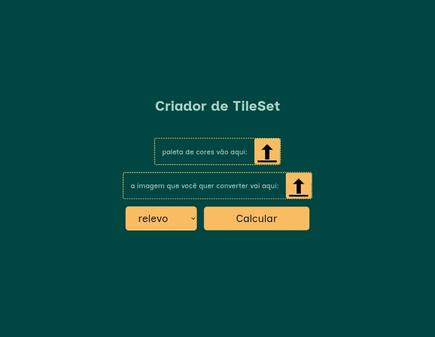

# O que é esse projeto?

esse foi um sub-projeto que eu por algum motivo fiz para fazer tilesets mais rápido.
<a href = "https://lonlysoft.github.io/2Images2tile">teste</a>

# Imagens do Projeto




O problema que já tinha sido resolvido para todo mundo, mas não para mim
-

um dos problemas que eu percebi enquanto eu fazia o Funky Pack era que muitas das minhas tilesets que eu queria fazer iriam demorar para ficarem prontas se eu quisesse fazer digitando numero por número. Então veio a ideia de fazer um programa que criasse esses tilesets de forma mais automática a partir de algo que eu tenho mais controle. Como Imagens.

Por que eu fiz isso ao invés de usar o tiled ou qualquer outro app/software que monta os tilesets de uma forma normal?
-

A Resposta é bem mais simples: Eu não tenho como fazer isso no celular. O tiled não existe para celulares então exportar uma matiz se torna praticamente impossivel, sendo as únicas opições escrever manualmente ou programar o seu proprio projetinho pra automatizar as paradas.

# Histórico

Versão Grotesca pré-Magical Sewer.
-

Já na época do magical sewer eu percebi que não era muito legal escrever e digitar matrizes grandes número por número pra fazer um mapa de jogo. Logo eu criei um software com esse mesmo intuito. entretanto ele não tinha tanta lógica.

- cores tinham que ser colocadas manualmente em um ```if...else``` bastante longo e isso não era nem um pouco automatizando.
- A matriz resultante era uma matriz de strings que tinham informações de tudo do jogo. Isso dava limitações de quão alto as colisões poderiam ser.
- A forma de executar o programa também não era pra das melhores. você teria que ter acesso ao console e tinha que rodar o seguinte snippet de código lá:
``` javascript
goEdit();
for(let i = 0; i < 80; i++){
	document.write("["+level[i]+"], ");
}


tweakColide();
openShadows();
for(let i = 0; i < 80; i++){
	document.write("["+colision[i]+"],");
}

goRelevo();
for(let i = 0; i < 80; i++){
	document.write(colision[i]+", \n");
}
```
 - essa gambiarra era chamada de ```hot_wiring.js``` e era de uma época que eu era burro e não sabia como resolver problemas de event listening no JS. A função era chamada na tag de script, mas nunca executada efetivamente. Obviamente isso foi feito devido a urgência de fazer qualquer coisa para continuar focado com o código do magical sewer, basicamente dizendo: isso não é um projeto principal eu não ligo é só dois for loops e pronto.
 

versão 1.0 de hoje em dia
-

após eu focar no funky pack eu tava mais vacinado contra event listeners e decidi voltar para fazer o mapa de forma mais automatizada, bonita, com uma interface gráfica, mais opções de envio e até fazer scripts dos npcs
- agora o mapa é dividido em múltiplos tilesets com matrizes para colisão, gráficos, objetos de cenário, npcs, gatilhos, itens e espaço de teleporte para outros mapas.
- por conta disso era necessário um sistema robusto que não dependesse de cores constantes, já que elas mudam de acordo com o contexto.
- essa preocupação me fez lembrar que as vezes no jogo eu utilizava numeros para tirar uma string de um array na posição do número e utilizar ela em um objeto.
- o metodo atual se baseia em pegar duas imagens e comparar os pixels da segunda com a primeira para gerar uma matriz. É quase como se fosse uma tabela hash só que sem as operações malucas de cálculo de colisão.
- o arquivo gerado é do tipo JSON. que acredite ou não, é util por conta do jogo ser realmente em javascript.
- As atualizações atuais constam agora um sistema de pré-visualização que faz com que você tenha uma noção de como o map vai ser desenhado.

versão 1.5
-

- Eu consegui me podar mais contra os event listeners. Aparentemente eu masterei os controles de toque (eu não exatamente masterei eles, mas agora não existe mais a disparidade antiga de você tocar e o toque registrar em uma coordenada longe
- Assim eu tenho a versão 1.5. Em que eu expandi para um horizonte mais interativo. O usuario agora poderá criar os próprios mapas do zero sem precisar colocar imagens. Alêm disso, houve o desenvolvimento de um algoritmo para automatizar o calculo do tileset de sombra (porém ainda não 100% testado) ele se baseia em pegar uma grid originalmente com só zeros e quando detectada uma elevação na tile de relevo ela aumenta a layer da coluna, fazendo com que a drawing order fique automatizada.
- as camadas são agora renderizadas em um só canvas. isso por incrível que pareça aumentou a performance e agora o usuário poderá desenhar tiles na camada selecionada sem se preocupar com a camada estar visivel em cima. coisa que os multiplos canvas não permitiam, além disso, o bug de do nada o usuário não poder usar a camada selecionada foi abolido!
- novas layers foram emplementadas, agora possuindo possibilidade para adicionar layers de itens e objetos.
- Em breve trabalharei na versão 1.6. Que trará a possibilidade de dar zoom e rotacionar o mapa, garantindo uma construção mais dinâmica.

Conclusão
-

É bem interessante perceber que o fato de ter só um celular e um tablet de 2016 me fez fazer um projeto que é simples e talvez até batido, mas bem útil para eu automatizar assets. Mesmo que seja feito só pra mim.
